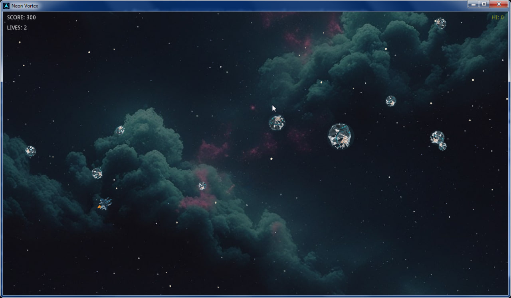

# Neon Vortex

Процедурный 2D-шутер (аркада) на **Godot 3.6.3** (GDScript 1.0).
Корабль, астероиды, враги, пули, бонусы и эффекты рисуются кодом (`_draw`) поверх процедурного звёздного поля; спрайты — только у корабля игрока, врага и бонуса.

## Скриншот

## Запуск

### Готовый билд (Windows)
Запустите `export/NeonVortex.exe` — это самодостаточный экспорт (ресурсы вшиты в exe), дополнительный Godot не нужен.

### Из исходников
1. Нужен **Godot 3.6.3** (например, `Godot_v3.6.3-stable_win64.exe`).
2. Импортировать ресурсы (создаст `.import/`):  
   `Godot_v3.6.3-stable_win64.exe --path . --import`
3. Запустить:  
   `Godot_v3.6.3-stable_win64.exe --path .`

### Пересборка exe
`Godot_v3.6.3-stable_win64.exe --path . --export "WindowsDesktop" "export/NeonVortex.exe"`

## Управление
- **WASD / стрелки** — движение
- **Мышь** — прицеливание
- **ЛКМ / Space** — огонь (удерживать = автоматический)
- **Esc / P** — пауза (меню: Resume / Restart / Main Menu)
- **Space / Enter** — старт / выбор пункта меню

## Меню и экраны
- Неоновый титульный экран: анимированный логотип, рекорд, кнопки **START GAME / HOW TO PLAY / MUSIC ON·OFF / QUIT**.
- Собственный процедурный фон меню (закатное солнце, перспективная сетка, звёзды) — рисуется кодом, без текстур.
- Управление меню: мышь (наведение + клик) или клавиатура (↑/↓ или W/S, Enter/Space — выбор, Esc/P — назад).
- Экраны **PAUSE** (Resume / Restart / Main Menu) и **GAME OVER** (итоговый счёт, «NEW RECORD!», Play Again / Main Menu).
- Переключатель музыки запоминается (`user://settings.save`).

## Особенности
- Нарастающая сложность: астероиды, вражеские корабли, бонусы.
- Бонусы: Triple Shot, Rapid Fire, Shield, Extra Life.
- Эффекты: взрывы-кольца, искры, вспышка урона, мигание при неуязвимости.
- Счёт и рекорд (сохраняется в `user://hi.save`).
- Аудио: короткие одноразовые SFX на WAV (зацикливание выключено на уровне ресурса и в коде), фоновая музыка на OGG.
- Диагностика: `NV_SELFTEST=1` проигрывает каждый SFX отдельным плеером и пишет тайминги остановки в `user://audiotest.log`; `NV_WALK=1` — авто-прогон UI (титул → бой → game over → выход).

## Аудио-ассеты
- SFX: Kenney — Sci-Fi Sounds / Interface Sounds (OpenGameArt, CC0).
- Меню-музыка: yd / XCVG — ambient (OpenGameArt, CC0).
- Боевая музыка: **Bensound — House** (https://www.bensound.com, © Benjamin Tissot, license code `RKTVGSVKAAHGUL1P`; текст лицензии в `assets/audio/Bensound_House_LICENSE.txt`).
- Конвертация: ffmpeg (SFX → WAV mono 44.1 кГц; музыка → OGG Vorbis).

## Лицензия
Свободное использование и модификация. Графика и код — собственные; аудио — CC0 (см. выше).
